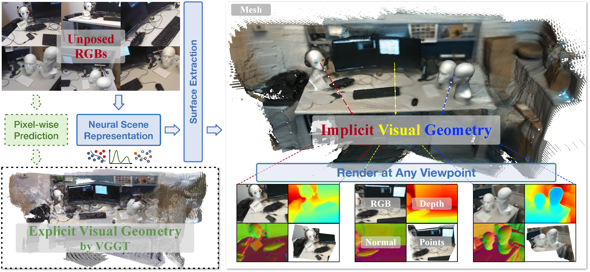
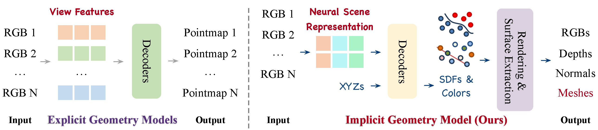
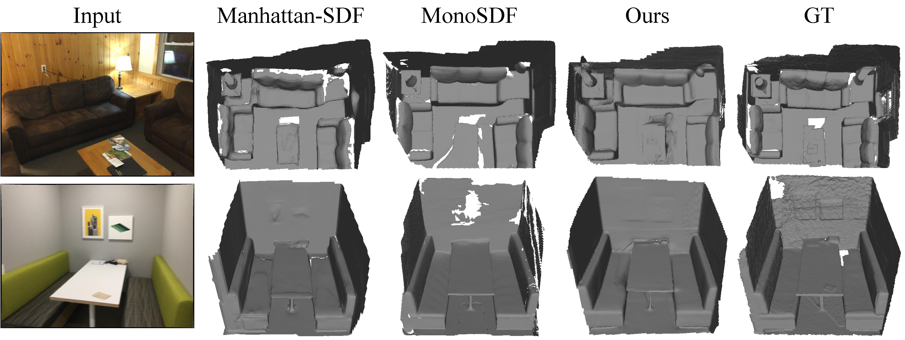
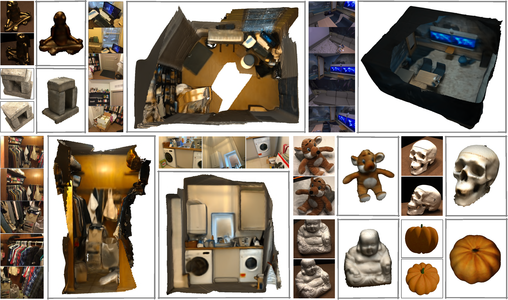
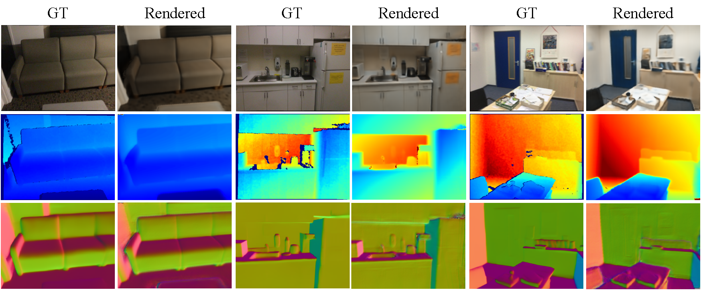
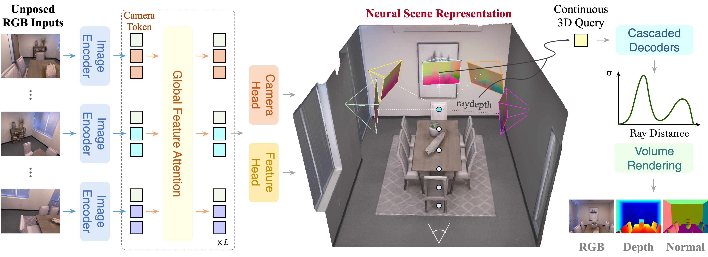

# IVGT: Implicit Visual Geometry Transformer for Neural Scene Representation

### [[Paper]](https://arxiv.org/pdf/2605.16258) [[Project]](https://wzzheng.net/IVGT/)

[Yuqi Wu](https://ykiwu.github.io/)<sup>\*</sup>, [Tianyu Hu](https://github.com/ttt-y)<sup>\*</sup>, [Wenzhao Zheng](https://wzzheng.net/)<sup>\*†</sup>, [Yuanhui Huang](https://huang-yh.github.io/), [Haowen Sun](https://scholar.google.com/citations?hl=zh-CN&user=tGepc6EAAAAJ), [Jie Zhou](https://scholar.google.com/citations?user=6a79aPwAAAAJ&hl=en&authuser=1), [Jiwen Lu](http://ivg.au.tsinghua.edu.cn/Jiwen_Lu/)

<sup>\*</sup> Equal contribution. <sup>†</sup> Project leader.

---

We propose **IVGT**, an **I**mplicit **V**isual **G**eometry **T**ransformer that implicitly models coherent 3D geometry and appearance from pose-free multi-view images in a **single feedforward pass**. It learns a continuous neural scene representation in a global canonical coordinate system, enabling diverse downstream tasks including mesh reconstruction, novel-view synthesis, and surface estimation across diverse scenes.



## News

- **[2026/5/18]** Paper released on [arXiv]().

---

## Key Highlights

### 1. Implicit vs. Explicit Visual Geometry

Most existing visual geometry foundation models (DUSt3R, VGGT, Point3R) follow an **explicit** paradigm, which directly decode a **pixel-aligned 3D point** for each input pixel. This leads to two fundamental limitations:
- **Discrete**: geometry only exists at pixel locations; arbitrary 3D positions cannot be queried.
- **Redundant**: the same surface point appearing in multiple views gets predicted independently, causing inconsistencies.

IVGT takes the opposite approach: we learn a **continuous 3D neural field** (SDF-based) queryable at any position in space.



> **Explicit models** decode per-pixel 3D coordinates for each view → discrete, view-indexed pointmaps.  
> **IVGT (implicit)** learns a continuous 3D field → direct surface extraction and novel view rendering without post-processing.

The advantage of implicit geometry over explicit pointmaps is most visible in surface quality. Pixel-aligned pointmap reconstruction suffers from sparsity and discontinuities, especially at object boundaries, while meshes extracted from IVGT's continuous SDF field are significantly more coherent and complete:


---

### 2. Pose-free Feed-forward Mesh Reconstruction


IVGT produces complete and coherent colored meshes across diverse indoor scenes and objects in a single forward pass:



> Qualitative mesh comparison on ScanNet. IVGT produces geometrically complete and surface-coherent meshes in one forward pass; per-scene optimization baselines often yield incomplete or fragmented surfaces.



> Colored mesh reconstruction across diverse indoor scenes and objects of varying scale, without any test-time optimization.

---

### 3. Unified Rendering and Surface Extraction from a Single SDF Field

The same SDF field supports **four output modalities from a single representation**:

- **RGB rendering** via differentiable volume rendering (SDF → density → color)
- **Depth maps** from the expected ray termination depth
- **Surface normal maps** from the SDF gradient
- **Continuous meshes** via Marching Cubes — directly and efficiently, without any post-processing



> IVGT renders RGB images, depth maps, and surface normal maps from arbitrary novel viewpoints. All three modalities are derived from the same SDF field without task-specific heads.

---

## Overview



Reconstructing coherent 3D geometry and appearance from unposed multi-view images is a fundamental yet challenging problem in computer vision. Most existing visual geometry foundation models predict explicit geometry by regressing pixel-aligned pointmaps, suffering from redundancy and limited geometric continuity. IVGT learns a continuous implicit neural scene representation in a canonical coordinate system, supports continuous spatial queries at any 3D position, and predicts SDF values and colors using lightweight decoders — enabling rendering and surface extraction from arbitrary viewpoints.

We train IVGT via multi-dataset joint optimization with only 2D supervision and 3D geometric regularization, achieving generalization across scenes with strong performance on mesh reconstruction, point cloud reconstruction, novel view synthesis, depth estimation, surface normal estimation, and camera pose estimation.

---

## Results

### Mesh Reconstruction

IVGT extracts continuous, coherent meshes directly from its SDF field. As a **generalizable feed-forward** method (no per-scene optimization), it surpasses most per-scene optimization baselines on ScanNet:

| Method | Setting | Acc ↓ | Comp ↓ | Chamfer ↓ | F-score ↑ |
|---|---|---|---|---|---|
| COLMAP | Per-Scene | 0.047 | 0.235 | 0.141 | 0.537 |
| NeuS | Per-Scene | 0.179 | 0.208 | 0.194 | 0.291 |
| MonoSDF | Per-Scene | **0.035** | **0.048** | **0.042** | **0.733** |
| **IVGT** | Generalizable | 0.069 | 0.051 | 0.060 | 0.647 |

> IVGT ranks second only to MonoSDF — which requires **hours of per-scene optimization** — while running in a **single forward pass**.

### Pointmap Reconstruction

IVGT's depth maps (decoded directly from per-view features) achieve state-of-the-art pointmap reconstruction, **outperforming VGGT on 7-Scenes and NRGBD** despite pointmap reconstruction being a by-product of IVGT rather than its primary target:

| Method | 7-Scenes Acc ↓ | 7-Scenes Comp ↓ | NRGBD Acc ↓ | NRGBD Comp ↓ |
|---|---|---|---|---|
| Fast3R | 0.053 | 0.084 | 0.080 | 0.075 |
| CUT3R | 0.024 | 0.028 | 0.086 | 0.047 |
| VGGT | 0.020 | 0.028 | 0.018 | 0.017 |
| **IVGT** | **0.016** | **0.021** | **0.017** | **0.015** |

### Novel View Synthesis

| Method | RE10K-2v PSNR ↑ | RE10K-2v SSIM ↑ | DL3DV-8v PSNR ↑ | DL3DV-8v SSIM ↑ |
|---|---|---|---|---|
| FLARE | 16.33 | 0.574 | 15.35 | 0.516 |
| AnySplat | 17.62 | 0.616 | 18.31 | 0.569 |
| WorldMirror | **20.62** | **0.706** | **20.92** | **0.667** |
| **IVGT** | 18.97 | 0.656 | 19.74 | 0.627 |

### Depth Estimation (Abs Rel ↓)

| Method | NYUv2 Mono | Sintel Mono | Sintel Video |
|---|---|---|---|
| VGGT | **0.056** | 0.606 | 0.299 |
| **IVGT** | 0.063 | **0.309** | **0.295** |

### Surface Normal Estimation (NYUv2, within 30° ↑)

| Method | NYUv2 mean ↓ | NYUv2 30° ↑ | iBims-1 mean ↓ |
|---|---|---|---|
| DSine | **16.4** | 83.5 | **17.1** |
| **IVGT** | 16.6 | **84.2** | 20.1 |

### Camera Pose Estimation

| Method | ScanNet ATE ↓ | Sintel ATE ↓ | TUM-dyn ATE ↓ |
|---|---|---|---|
| Fast3R | 0.084 | 0.274 | 0.048 |
| VGGT | 0.035 | 0.169 | **0.012** |
| WorldMirror | 0.037 | **0.121** | **0.012** |
| **IVGT** | **0.032** | 0.140 | **0.012** |


---

## Getting Started

We will release the code soon.

---

## Citation

If you find this project helpful, please consider citing the following paper:
```bibtex

```
